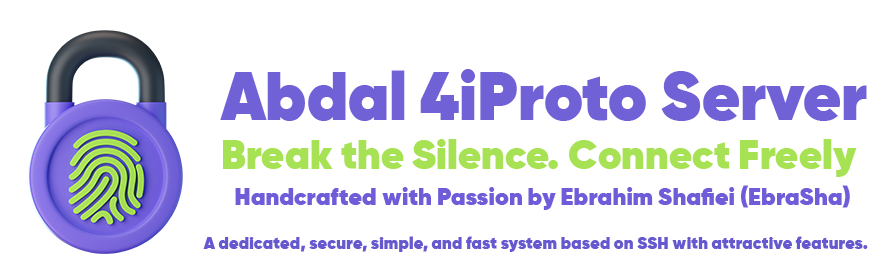

  

# 🧬 The Abdal 4iProto Ecosystem

> **A Secure, Fast, and Modular SSH-based Tunneling Ecosystem — Built by Abdal, Led by Ebrahim Shafiei (EbraSha)**

---

## 🌍 Overview

**Abdal 4iProto** is a complete, cross-platform ecosystem built on top of the SSH protocol — engineered for **secure tunneling**, **advanced management**, and **real-time traffic monitoring**.  
The ecosystem integrates multiple interconnected components, each designed for performance, scalability, and security.

---

## 🧩 Core Components

| Component | Description | Repository |
|------------|-------------|-------------|
| 🔐 **Abdal 4iProto Server** | High-performance SSH-based tunneling server with advanced security, rate limiting, and accounting features. | [abdal-4iproto-server](https://github.com/ebrasha/abdal-4iproto-server) |
| ⚙️ **Abdal 4iProto Panel** | Web-based management panel for real-time control, user management, and monitoring — single-file executable built in Go. | [abdal-4iproto-panel](https://github.com/ebrasha/abdal-4iproto-panel) |
| 💻 **Abdal 4iProto Client** | Modern Windows client providing one-click connection and local SOCKS5 proxy with a futuristic interface. | [abdal-4iproto-client](https://github.com/ebrasha/abdal-4iproto-client) |
| 🗝️ **Abdal 4iProto Server SSH KeyGen** | Interactive and CLI-based SSH key generator supporting RSA, ED25519, and ECDSA algorithms. | [abdal-4iproto-server-ssh-keygen](https://github.com/ebrasha/abdal-4iproto-server-ssh-keygen) |

---

## 🚀 Key Highlights

- **Fully SSH-based architecture** — No custom encryption layer needed, built atop proven cryptographic foundations.  
- **Cross-platform support** — Linux & Windows compatibility for both server and panel.  
- **Advanced Traffic & Session Control** — Dynamic session TTLs, user-specific rate limits, and live bandwidth enforcement.  
- **Embedded Management Panel** — No external dependencies or databases required.  
- **Real-time Monitoring** — Session tracking, IP blocking, domain filtering, and per-user analytics.  
- **Modern UX/UI** — Focused on usability, responsiveness, and smooth workflow.  

---

## 🧠 Vision

> “Break the silence. Connect freely.”  
> The **Abdal 4iProto Ecosystem** aims to redefine secure communication by merging **cybersecurity**, **automation**, and **performance** into a unified, user-friendly framework — built with Go and powered by open-source innovation.

---

## 🤝 Contribution

We welcome developers, cybersecurity researchers, and network engineers to collaborate and expand the 4iProto ecosystem.  
Feel free to fork, star ⭐, and contribute to any module.

---

## 📫 Contact

**Programmer:** Ebrahim Shafiei (EbraSha)  
📧 Email: [Prof.Shafiei@gmail.com](mailto:Prof.Shafiei@gmail.com)  
💬 Telegram: [@ProfShafiei](https://t.me/ProfShafiei)  
🐙 GitHub: [@ebrasha](https://github.com/ebrasha)  
🌐 Website: [https://ebrasha.com](https://ebrasha.com)

---

> **Abdal 4iProto** — Secure, Fast, Unified.  
> Crafted with ❤️ by **Abdal** — Guided by **EbraSha**.
